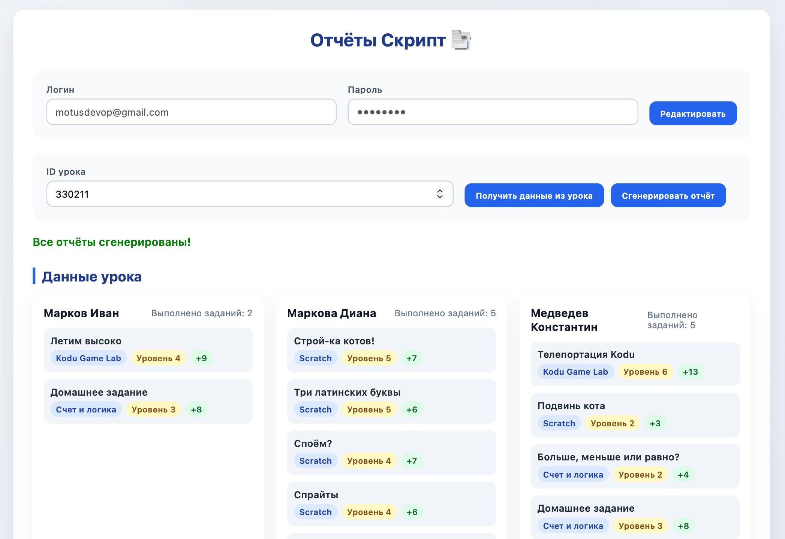

# 📑 AutoReportsForScript

Автоматизированный сервис для парсинга административного сайта Softium и генерации отчётов о занятиях детей с использованием Google Gemini AI.

## 🎯 Описание

Этот проект представляет собой веб-приложение на FastAPI, которое:
- Автоматически парсит данные о занятиях детей с административного сайта Softium
- Генерирует связные, персонализированные отчёты с помощью Google Gemini AI
- Предоставляет удобный веб-интерфейс для работы с данными и генерации отчётов

## ✨ Возможности

- 🔐 **Безопасное хранение учётных данных** — логин и пароль сохраняются локально в браузере
- 📊 **Парсинг данных урока** — автоматическое извлечение информации о детях и выполненных заданиях
- 🤖 **AI-генерация отчётов** — создание связных, естественных отчётов с помощью Gemini 2.5 Flash
- 👥 **Пакетная обработка** — генерация отчётов для всех детей в уроке одновременно
- 🎨 **Современный UI** — интуитивный интерфейс с предпросмотром данных

## 📸 Скриншоты

### Главный экран


### Интерфейс генерации отчётов


## 🛠 Технологический стек

### Backend
- **FastAPI** — современный веб-фреймворк для Python
- **BeautifulSoup4** — парсинг HTML
- **PyCurl** — HTTP-запросы
- **Google Generative AI** — интеграция с Gemini API
- **Pydantic** — валидация данных
- **Loguru** — логирование

### Frontend
- **Vanilla JavaScript** — без фреймворков
- **HTML5/CSS3** — современная разметка и стили
- **CryptoJS** — шифрование данных в localStorage

### Инфраструктура
- **Docker** — контейнеризация приложения
- **Docker Compose** — оркестрация контейнеров

## 📋 Требования

- Docker и Docker Compose
- Google Gemini API ключ
- Учётные данные для доступа к административному сайту Softium

## 🚀 Быстрый старт

### 1. Клонирование репозитория

```bash
git clone https://github.com/yourusername/AutoReportsForScript.git
cd AutoReportsForScript
```

### 2. Настройка переменных окружения

Создайте файл `.env` в корне проекта на основе `exampe.env`:

```bash
cp exampe.env .env
```

Отредактируйте `.env` и укажите ваш API ключ Gemini:

```env
GEMINI_API_KEY="your_real_gemini_api_key_here"
BASE_URL="https://fanfan.softium-deti.ru:820"
```

### 3. Запуск через Docker Compose

```bash
docker-compose up -d
```

Приложение будет доступно по адресу: **http://localhost**

> **Примечание:** Если порт 80 занят, измените маппинг портов в `docker-compose.yml`:
> ```yaml
> ports:
>   - "8080:80"  # или другой свободный порт
> ```

### 4. Проверка работы

Откройте браузер и перейдите по адресу `http://localhost`. Вы должны увидеть главный экран приложения.

## 📖 Использование

### Шаг 1: Сохранение учётных данных

1. Введите логин и пароль для доступа к административному сайту Softium
2. Нажмите кнопку **"Сохранить"**
3. Данные будут зашифрованы и сохранены в localStorage браузера

> **Безопасность:** Учётные данные хранятся только локально в вашем браузере и не передаются на сервер без необходимости.

### Шаг 2: Получение данных урока

1. Введите **ID урока** в соответствующее поле
2. Нажмите кнопку **"Получить данные из урока"**
3. Дождитесь загрузки данных — вы увидите список детей и выполненных заданий

### Шаг 3: Генерация отчётов

1. После успешной загрузки данных нажмите **"Сгенерировать отчёт"**
2. Система автоматически создаст отчёты для всех детей в уроке
3. Отчёты будут отображаться в реальном времени по мере генерации

## ⚙️ Конфигурация

### Переменные окружения

| Переменная | Описание | Обязательная |
|-----------|----------|--------------|
| `GEMINI_API_KEY` | API ключ для Google Gemini | Да |
| `BASE_URL` | Базовый URL административного сайта Softium | Нет (по умолчанию: `https://fanfan.softium-deti.ru:820`) |

### Настройка промпта для генерации

Промпт для генерации отчётов настраивается в файле `app/config.py`. Текущий промпт настроен на:
- Использование краткой формы имени
- Фокус на процессе работы, а не на заданиях
- Простой, нейтральный стиль
- 1-2 предложения в одном абзаце

## 📁 Структура проекта

```
AutoReportsForScript/
├── app/                    # Основное приложение
│   ├── main.py            # Точка входа FastAPI
│   ├── config.py          # Конфигурация и настройки
│   ├── logger_config.py   # Настройка логирования
│   ├── schemas.py         # Pydantic модели
│   ├── models/            # Модели данных
│   │   └── softium.py
│   ├── routes/            # API маршруты
│   │   ├── reports.py     # Эндпоинты для генерации отчётов
│   │   └── softium.py     # Эндпоинты для парсинга
│   └── services/          # Бизнес-логика
│       ├── reports.py            # Генерация отчётов через Gemini
│       ├── softium_client.py     # HTTP-клиент для Softium
│       ├── softium_parser.py     # Парсинг HTML
│       └── softium_scraper.py   # Основной скрапер
├── static/                # Frontend файлы
│   ├── index.html        # Главная страница
│   ├── style.css         # Стили
│   └── app.js            # JavaScript логика
├── assets/               # Изображения для README
│   ├── main.jpg
│   └── generate_ui.jpg
├── logs/                 # Логи приложения
├── docker-compose.yml    # Конфигурация Docker Compose
├── Dockerfile            # Образ Docker
├── exampe.env            # Пример файла окружения
└── README.md             # Этот файл
```

## 🔧 Разработка

### Локальная разработка без Docker

1. Установите зависимости:
```bash
pip install -r app/requirements.txt
```

2. Создайте файл `.env` с переменными окружения

3. Запустите приложение:
```bash
uvicorn app.main:app --reload --host 0.0.0.0 --port 80
```

### Просмотр логов

Логи приложения сохраняются в директории `logs/`:

```bash
# Просмотр логов в реальном времени
tail -f logs/app.log

# Или через Docker
docker-compose logs -f api
```

## 🐛 Устранение неполадок

### Проблема: Порт 80 занят

**Решение:** Измените маппинг портов в `docker-compose.yml`:
```yaml
ports:
  - "8080:80"  # Используйте другой порт
```

### Проблема: Ошибка при парсинге данных

**Решение:** 
- Проверьте правильность учётных данных
- Убедитесь, что ID урока существует
- Проверьте доступность сайта Softium

### Проблема: Ошибка генерации отчёта

**Решение:**
- Проверьте валидность `GEMINI_API_KEY` в `.env`
- Убедитесь, что у вас есть доступ к API Gemini
- Проверьте логи приложения для деталей ошибки

## 📝 API Endpoints

### GET `/scraper/get_lesson_data`
Получение данных урока из Softium.

**Параметры:**
- `username` (string) — логин
- `password` (string) — пароль
- `lesson_id` (int) — ID урока

**Ответ:**
```json
{
  "children": [
    {
      "name": "Имя ребёнка",
      "child_id": 123,
      "lesson_id": "456",
      "arepid": 789,
      "done_tasks_count": 5,
      "tasks": [...]
    }
  ]
}
```

### POST `/reports/generate`
Генерация отчёта для одного ребёнка.

**Тело запроса:**
```json
{
  "child": {
    "name": "Имя ребёнка",
    "child_id": 123,
    "lesson_id": "456",
    "arepid": 789,
    "done_tasks_count": 5,
    "tasks": [...]
  }
}
```

**Ответ:**
```json
{
  "status": "success",
  "child_id": 123,
  "child_name": "Имя ребёнка",
  "report": "Сгенерированный отчёт..."
}
```

## 🤝 Вклад в проект

Мы приветствуем вклад в развитие проекта! Пожалуйста:

1. Форкните репозиторий
2. Создайте ветку для новой функции (`git checkout -b feature/AmazingFeature`)
3. Закоммитьте изменения (`git commit -m 'Add some AmazingFeature'`)
4. Запушьте в ветку (`git push origin feature/AmazingFeature`)
5. Откройте Pull Request

## 📄 Лицензия

Этот проект распространяется под лицензией MIT. См. файл `LICENSE` для подробностей.

## 👤 Автор

Создано с ❤️ для автоматизации работы с отчётами Softium.

## 🙏 Благодарности

- Google Gemini за мощный AI API
- FastAPI за отличный фреймворк
- Всем контрибьюторам проекта

---

⭐ Если проект был полезен, поставьте звезду!

